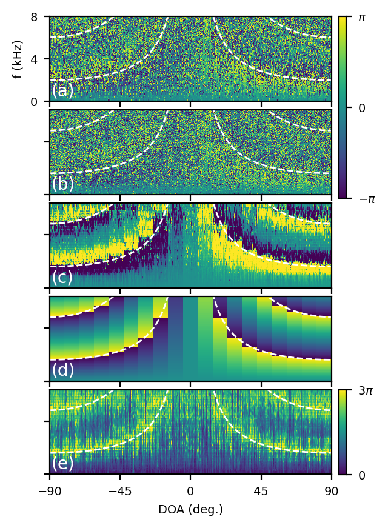

# Semi-supervised source localization in reverberant environments with deep generative modeling

Official implementation of *Semi-supervised source localization with deep generative modeling*, (Bianco et al. 2021) ([paper](https://doi.org/10.1109/ACCESS.2021.3087697)). In this machine learning-based approach to acoustic source localization, a variational autoencoder (VAE) is trained to generate the relative transfer function (RTF) phase for two microphones. The VAE model is trained in parallel with a classifier network, which estimates the direction of arrival for an acoustic source. Both models are trained on both labelled and unlabeled RTF-phase sequences, generated from speech in reverberant environments.

This deep generative semi-supervised approach performs well relative to fully-supervised and conventional, signal processing-based source localization approaches when large, but sparsely labeled, datasets are available. Further, the trained VAE can conditionally generate RTF-phase sequences.

As part of this study, a new room acoustics dataset was collected onbtained in a classroom at the Technical University of Denmark (DTU) (Fernandez-Grande et al. 2021)
([dataset](https://dx.doi.org/10.21227/c5cn-jv76)). This dataset included off-grid and off-range source locations, to test model generalization. To obtain reverberant speech data, speech segments were obtained from the [Librispeech devlopment corpus](https://www.openslr.org/12) and convolved with recorded room IRs. More details of the process are given in our [paper](https://doi.org/10.1109/ACCESS.2021.3087697).

The neural networks and variational inference were implemented with Pytorch and the [Pyro](https://pyro.ai/) probabilistic programming library.



## Requirements

This code was developed in a virtual environment managed by Anaconda. The requirements.yml file contains packages managed by conda and pip, which can be installed using
```
conda env create --file requirements.yml
```

## Datasets

This distribution is configured to use reverberant speech obtain using [DTU dataset](https://dx.doi.org/10.21227/c5cn-jv76) IRs. The datasets, processed training and validation data, are available for [download here](https://acsweb.ucsd.edu/~mbianco/data/). Each file contains the raw waveform from twenty 2-3 second audio clips of reverberant speech from each of the DOAs.

## Training

Three pretrained models for VAE-SSL and fully-supervised CNN are provded in this repository. To train your own VAE-SSL model, using the virtual environent based on the requirements, run
```
python vaessl_train.py --cuda-id <your cuda ID>\
                        --path-save <your path for saving the trained model>
```
  
The default_paths.json file contains paths, datasets, and models for training and evaluation. These can either be changed in the .json file, or at the command line.

While you can technically train VAE-SSL on a CPU (this is set as default), it is prohibitively slow to do so.

Code is also provided for training and evaluating a fully-supervised convolutional neural network (CNN). This CNN is the same architecture used by the VAE-SSL classifier.

To train your own CNN model, run
```
python cnn_train.py --cuda-id <your cuda ID>\
                    --path-save <your path for saving the trained model>
```


## Evaluation
The trained models can be evaluated by
```
python vaessl_eval.py --cuda-id <your cuda ID>\
                       --path-save <path to saved model>
```
```
python cnn_eval.py --cuda-id <your cuda ID>\
                   --path-save <path to saved model>
```
Calling the script without any flags will evaluate using the pretrained models and datasets.

## Conventional DOA estimation
This repository has an implementation of conventional DOA estimation algorithms, which uses the [Pyroomacoustics](https://pyroomacoustics.readthedocs.io/en/pypi-release/index.html) library. In the paper, the ML-based approaches are compared with SRP-PHAT and MUSIC DOA-estimation. To obtain source localization results for these methods, use
```
python conventional_doa.py --algo <the name of the algorithm, 'SRP' or 'MUSIC'>
```

## Visualization
This repository also includes a [Jupyter notebook](https://github.com/mikebianco/vaessl-doa/blob/main/generative_viz.ipynb) for visualizing the reconstruction and conditional generation of RTF-phase sequences using VAE-SSL. The notebook contains the code used to generate Figures 4--8 in the [paper](https://doi.org/10.1109/ACCESS.2021.3087697).


### Attribution

If you use this code in your research, cite via the following BibTeX:

```
@article{bianco2021semi,
  title={Semi-supervised source localization in reverberant environments with deep generative modeling},
  author={Bianco, Michael J and Gannot, Sharon and Fernandez-Grande, Efren and Gerstoft, Peter},
  journal={IEEE Access},
  year={2021},
  publisher={IEEE}
}
```
